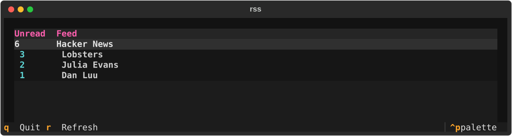
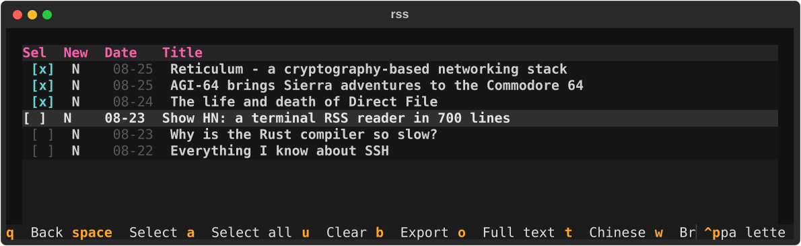
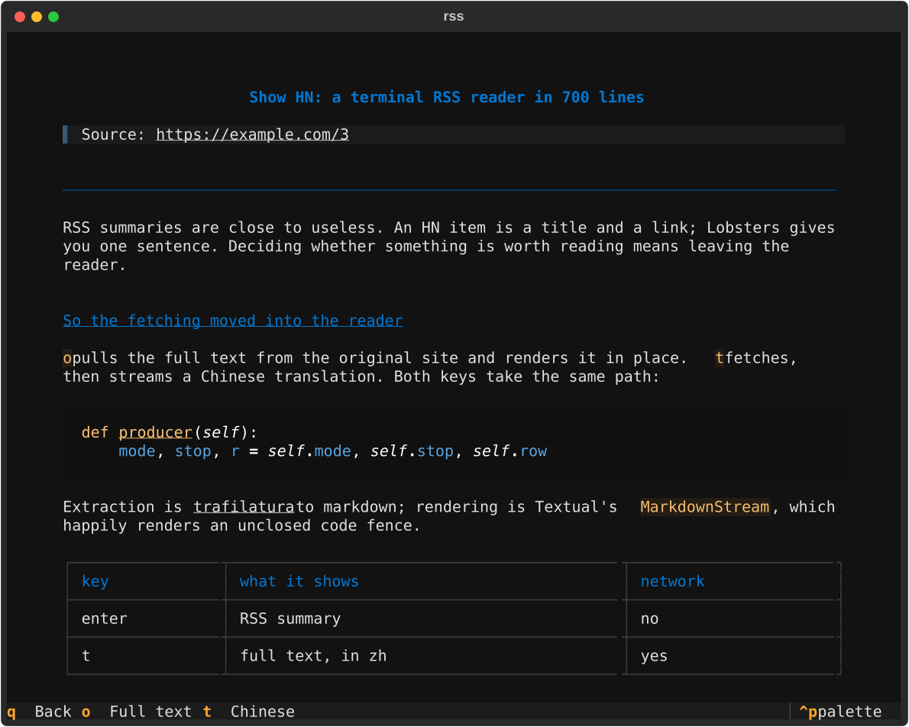

# rss

[English](README.md) · [中文](README.zh-CN.md)

A terminal RSS reader built to my own taste. Careful UI, small feature set, two Python files.







## What it does

- **Feeds in one config file.** URLs, display names, tags. Tag them and `rotate` shows one group per day.
- **Reads in the terminal.** Type `rss` anywhere. No browser, no daemon, no sync account.
- **Fetches the real article.** RSS summaries are close to useless, so `o` pulls the full page and renders it in place.
- **Translates with an LLM.** `t` streams a Chinese translation. First words in 2 to 4 seconds.
- **Ten keys, no config DSL.**
- **Textual UI.** Streaming markdown, tables, code blocks, syntax highlighting.
- **Exports to Markdown.** Select a batch, press `b`, clean `.md` files land in your notes folder.

## Install

```bash
git clone https://github.com/pangmaowang/rss-bot && cd rss-bot
python3 -m venv .venv && .venv/bin/pip install -r requirements.txt
chmod +x grab.py reader.py
ln -sf "$PWD/grab.py" /opt/homebrew/bin/rss
```

Edit `config.toml` for feeds and the export directory. Translation needs an API key in `.env`:

```bash
cp .env.example .env && chmod 600 .env && vi .env
```

Any OpenAI-compatible `/chat/completions` endpoint works, so OpenRouter, DeepSeek, or a local vLLM is a one-line change.

## Keys

| key | action |
|---|---|
| enter | RSS summary from the feed |
| `→` / `←` | one level in / one level out |
| `o` | fetch the full article, render in place |
| `t` | fetch, then stream a Chinese translation |
| `w` | open in the system browser |
| space | select or deselect, cursor moves down |
| `a` / `u` | select all in this feed / clear the selection |
| `b` | export the selection in the background |
| `r` | refresh every feed |
| `q` | back one level, or quit from the feed list |

Selections carry across feeds. Read state lives in `~/.local/state/grab/cache.db`.

## License

MIT, see [LICENSE](LICENSE). The sqlite schema, the guid fallback, and the `feeds` line syntax follow [newsboat](https://github.com/newsboat/newsboat) (MIT) so the old database keeps working. No newsboat code ships here.
